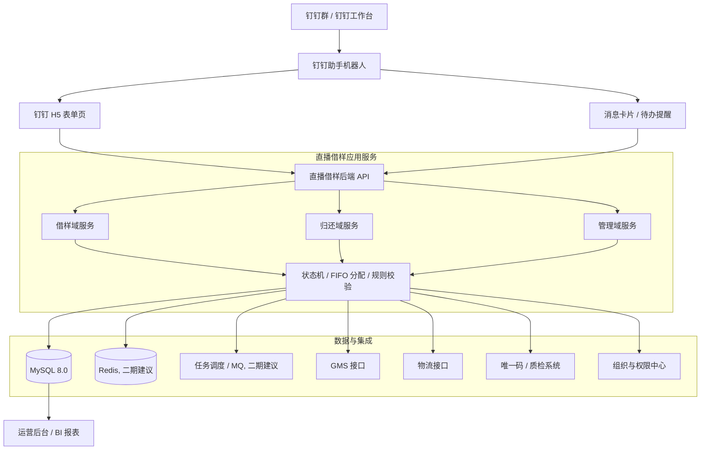
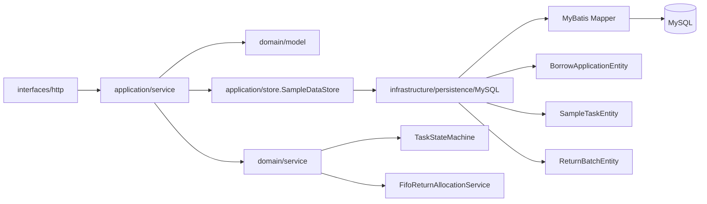
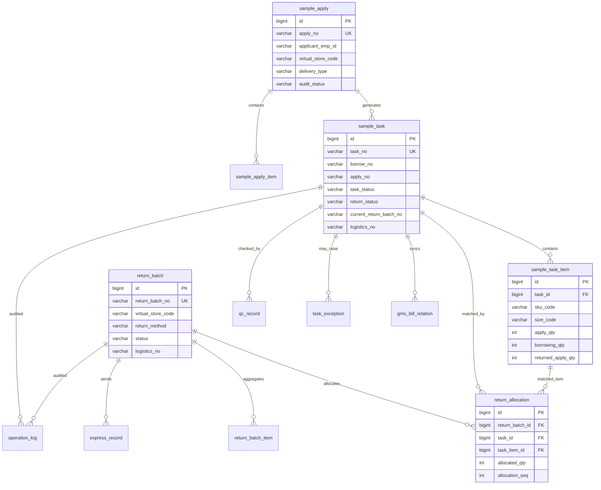
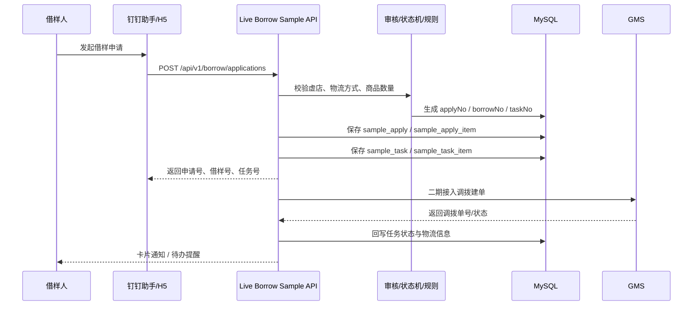
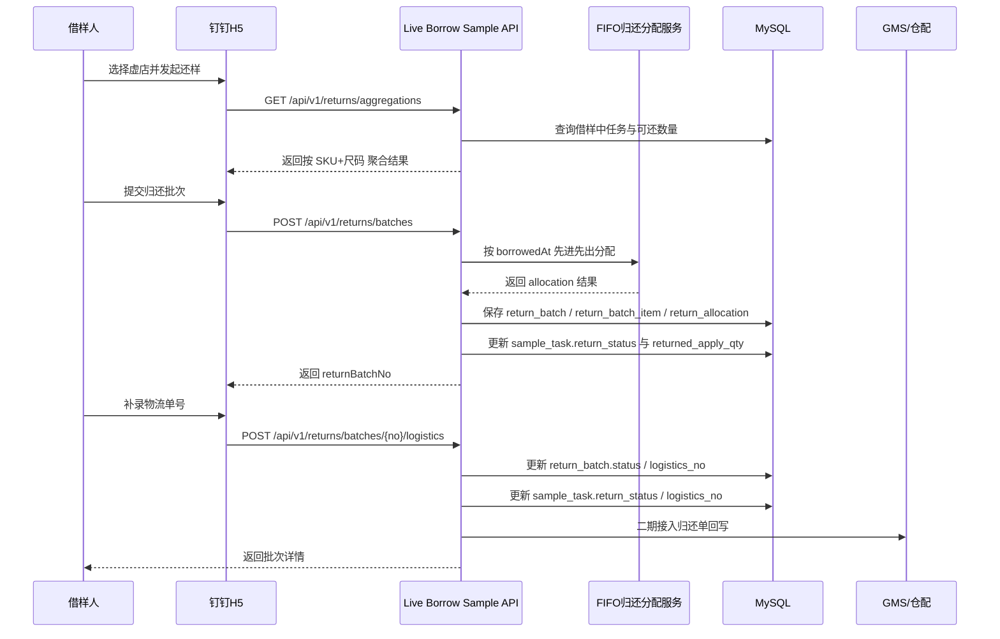
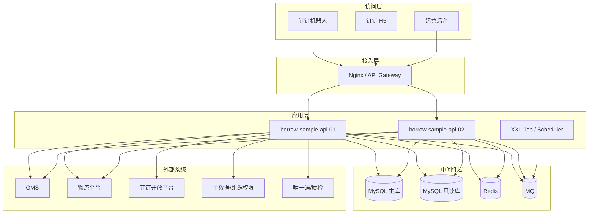

# 直播借样实现架构图与落地方案

## 1. 目标与范围

本文档给出直播借样一期 MVP 的可落地实现架构，覆盖以下范围：

- 钉钉助手入口
- Spring Boot 3 / Java 17 后端服务
- MyBatis + MySQL 数据持久化
- 借样申请、任务流转、通用归还、物流补录核心闭环
- 本地开发到生产部署的迁移边界

当前代码实现已按本文档的核心链路落地，并完成本地 MySQL 烟测验证。

## 2. 总体系统架构图

## 3. 后端分层实现图

## 4. 核心数据架构图

## 5. 借样主流程时序图

## 6. 通用归还主流程时序图

## 7. 生产部署架构图

## 8. 模块职责拆分

| 模块 | 责任 | 当前状态 |
| --- | --- | --- |
| `interfaces/http` | REST API、参数校验、统一返回体 | 已落地 |
| `application/service` | 用例编排、事务边界、响应组装 | 已落地 |
| `domain/model` | 任务、归还批次、申请单等领域状态 | 已落地 |
| `domain/service` | 状态机、FIFO 分配规则 | 已落地 |
| `application/store` | 存储抽象，隔离业务与持久化 | 已落地 |
| `infrastructure/persistence` | MyBatis Mapper、Entity、MySQL 读写 | 已落地 |
| `integration/gms` | 调拨建单、状态回写 | 待接入 |
| `integration/logistics` | 物流单查询、签收回执 | 待接入 |
| `integration/dingtalk` | 用户身份、卡片回调、待办通知 | 待接入 |
| `job/async` | 超时扫描、补偿、重试、回调消费 | 二期建议 |

## 9. 当前实现与生产版差异

### 已完成

- Spring Boot 3 / Java 17 项目骨架
- MyBatis + MySQL 持久化
- 本地 `local` profile 数据源配置
- 幂等可重复执行的 schema / seed 脚本
- 借样创建、任务查询、聚合归还、归还批次创建、物流补录
- 本地真实烟测

### 待补齐

- 钉钉机器人事件回调
- 钉钉 H5 鉴权与用户态透传
- GMS 建单、收货、回填物流、调拨状态同步
- 物流平台回调与定时对账
- 操作日志、幂等表、集成调用日志的正式写入
- 统一认证、权限模型、审计追踪
- Redis 缓存、消息队列、定时补偿任务

## 10. 生产落地建议

### 配置切换

- 本地阶段继续使用 `SPRING_PROFILES_ACTIVE=local`
- 生产环境切 `prod` profile，不改代码，只改环境变量
- 数据源、钉钉密钥、GMS 凭证、物流密钥全部走环境变量或配置中心

### 数据库建议

- 当前 `biz_sequence` 可支撑单库单应用编号生成
- 生产若多实例部署，建议升级为：
  - Redis 原子序列
  - Leaf / segment-id
  - 或数据库号段预分配服务

### 事务与一致性建议

- 申请落库、任务落库、归还批次落库保持单库本地事务
- 调 GMS / 物流接口改为 outbox + MQ 异步补偿
- 关键接口增加幂等键和操作日志

### 部署建议

- API 服务至少双实例
- MySQL 主从分离
- Redis 做缓存、幂等、短期状态机锁
- MQ 承担外部回调、补偿、通知
- 接口网关做鉴权、限流、签名校验

## 11. 本地验证结果

本地已完成以下验证：

- `mvn test` 通过
- 本地 MySQL 权限修复完成，`ycf / ycf012!` 可直接连接
- `sql/mvp_schema.sql` 可执行
- `sql/seed_data.sql` 可重复执行
- 应用已用 `local` profile 成功启动
- 已验证接口：
  - `GET /api/v1/health`
  - `GET /api/v1/borrow/tasks`
  - `GET /api/v1/returns/virtual-stores`
  - `POST /api/v1/borrow/applications`
  - `POST /api/v1/returns/batches`
  - `POST /api/v1/returns/batches/{returnBatchNo}/logistics`

## 12. 结论

当前仓库已经从“方案文档 + 骨架”推进到“本地 MySQL 可运行的 MVP 后端”。  
下一步如果继续推进到可上线版本，优先级应为：

1. 接入钉钉身份与回调
2. 接入 GMS 和物流平台
3. 补齐异步补偿、日志审计、权限与告警
4. 完成运营后台与生产部署流水线
