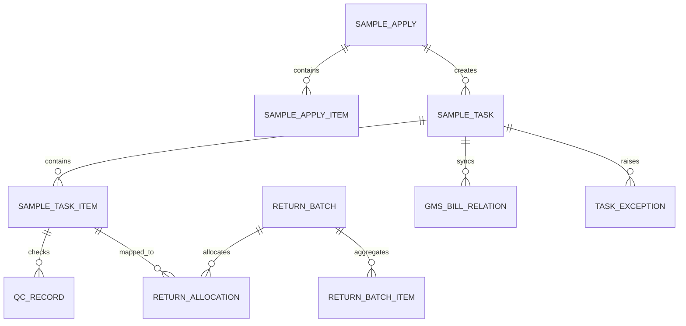

# 直播借样数据架构设计

## 1. 目标

本文件从数据架构师视角定义一期 MVP 的逻辑模型、主题域、主数据边界、事件模型、指标口径与治理要求。

## 2. 数据主题域

### 2.1 主数据域

- 员工
- 组织
- 虚店
- 实体门店
- 仓库
- 商品 / SKU / 尺码
- 物流公司

### 2.2 交易域

- 借样申请
- 借样任务
- 任务明细
- 归还批次
- 归还分配
- 物流记录
- GMS 单据关系

### 2.3 风控与运营域

- 黑名单规则
- 借样额度规则
- 异常池
- 操作日志
- 外部接口日志
- 幂等请求

### 2.4 质检与销账域

- 唯一码档案
- 质检记录
- 销账结果

## 3. 核心实体关系

```text
sample_apply 1 --- n sample_apply_item
sample_apply 1 --- n sample_task
sample_task 1 --- n sample_task_item
return_batch 1 --- n return_batch_item
return_batch 1 --- n return_allocation
sample_task_item 1 --- n return_allocation
sample_task 1 --- n gms_bill_relation
sample_task / return_batch 1 --- n express_record
sample_task_item 1 --- n qc_record
sample_task 1 --- n task_exception
任意业务单 1 --- n operation_log / integration_call_log
```

## 4. ER 图



## 5. 分层模型设计

## 5.1 主表层

保存业务主实体的当前状态：

- `sample_apply`
- `sample_task`
- `return_batch`

## 5.2 明细层

保存 SKU 级数据：

- `sample_apply_item`
- `sample_task_item`
- `return_batch_item`

## 5.3 关系层

保存映射关系，防止主表字段过载：

- `return_allocation`
- `gms_bill_relation`

## 5.4 事实日志层

保存审计和补偿依据：

- `operation_log`
- `integration_call_log`
- `express_record`
- `qc_record`
- `idempotent_request`

## 6. 主键与编号策略

### 6.1 数据库主键

- 所有交易表统一 `BIGINT UNSIGNED AUTO_INCREMENT`

### 6.2 业务编号

- 申请单：`BAyyyyMMddNNNN`
- 借样主单：`BRyyyyMMddNNNN`
- 任务单：`BTyyyyMMddNNNN`
- 归还批次：`RTyyyyMMddNNNNNN`
- 寻源方案：`SPyyyyMMddNNNN`

要求：

- 业务编号必须全局唯一
- 编号生成建议走号段或雪花算法，避免单库热点

## 7. 主数据边界

### 系统内维护

- 借样规则
- 额度规则
- 黑名单规则
- 操作日志
- 归还批次

### 外部系统提供

- 员工与组织：HR / IAM
- 虚店、门店、仓库：主数据平台
- 商品、SKU、可用库存：GMS
- 物流状态：丽讯 / 物流平台
- 唯一码流水：质检 / 库存流水系统

## 8. 数据字典摘要

### `sample_task.task_status`

- `CREATED`
- `AUDITING`
- `SOURCING`
- `TRANSFER_CREATING`
- `WAIT_SHIP`
- `WAIT_PICKUP`
- `IN_TRANSIT`
- `BORROWING`
- `RETURNING`
- `QUALITY_CHECKING`
- `COMPLETED`
- `ABNORMAL_PENDING`
- `CLOSED`

### `sample_task.delivery_type`

- `EXPRESS`
- `PICKUP`

### `return_batch.return_method`

- `EXPRESS`
- `IN_PERSON`

## 9. 数据质量规则

- 同一 `task_no` 不允许重复
- `return_allocation.allocated_qty` 必须大于 0
- `sample_task_item.returned_apply_qty` 不得超过可借样数量
- `express_record` 同业务维度内不允许重复物流单
- `qc_record.unique_code` 必须唯一

## 10. 事件模型

建议统一事件表述，后续可进入 MQ 或 CDC：

- `BorrowApplySubmitted`
- `BorrowApplyApproved`
- `BorrowTaskCreated`
- `BorrowTaskShipped`
- `BorrowTaskReceived`
- `PickupConfirmed`
- `ReturnBatchCreated`
- `ReturnAllocationCompleted`
- `ReturnLogisticsFilled`
- `WarehouseReceived`
- `QualityCheckPassed`
- `QualityCheckDegraded`
- `TaskCompleted`
- `TaskExceptionOpened`

## 11. 实时与离线指标

### 实时运营指标

- 当前借样中件数
- 当前待自提件数
- 当前待归还件数
- 当前待质检件数
- 当前异常任务数

### 离线分析指标

- 人均借样次数
- 虚店借样周转天数
- 商品借样频次
- 异常率趋势
- 自动销账率趋势

## 12. 分区与归档建议

一期数据量不大，不建议过早分库分表，但要预留归档策略：

- `operation_log`、`integration_call_log`、`express_record`、`qc_record` 建议按月归档
- 超过 12 个月的日志转冷存
- 主业务表保留在线可查

## 13. 索引策略

### 高查询频率索引

- 任务列表：`applicant_emp_id + task_status`
- 虚店归还查询：`virtual_store_code + task_status`
- 归还批次：`return_batch_no`
- GMS 对账：`gms_bill_no`
- 物流追踪：`logistics_no`

### 审计类索引

- `biz_type + biz_no`
- `trace_id`
- `operator_id + created_at`

## 14. 治理要求

- 所有枚举必须统一字典定义，不能前后端各自发明
- 所有对外接口调用必须记录请求与响应
- 关键数据变更必须落操作日志
- 指标口径必须写进数据文档，不允许口径漂移

## 15. 风险提示

- 若只在任务表存归还字段，后续会失去多次部分归还的可解释性
- 若没有接口日志，后续无法做 GMS 对账和补偿
- 若没有统一枚举字典，前后端和 BI 会出现状态口径不一致
