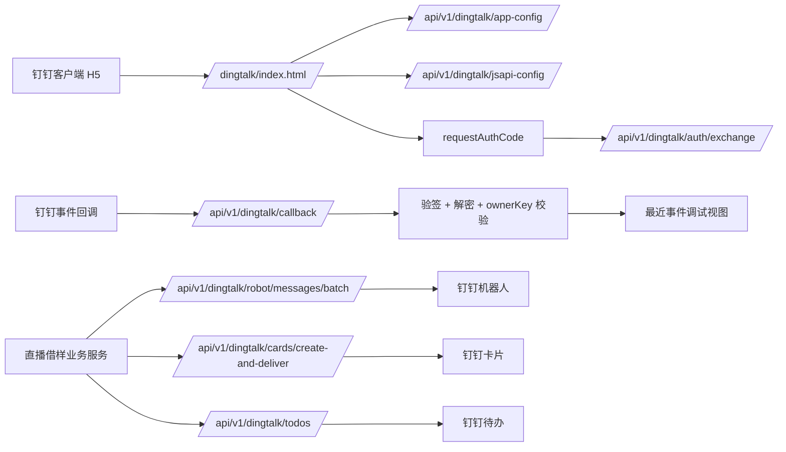

# 钉钉 H5 免登与回调配置清单

本文档用于把直播借样一期 MVP 的钉钉接入配置一次性落清楚，覆盖 H5 免登、事件回调，以及可选的机器人消息、卡片投放和待办通知。

一期正式业务入口是 H5 页面。机器人、互动卡片和待办属于通知与跳转能力，不承载完整借样/归还流程。

## 1. 当前系统已提供的入口

- H5 联调页：`/dingtalk/index.html`
- H5 一期业务页：`/dingtalk/borrow-assistant.html`
- H5 免登后端接口：`/api/v1/dingtalk/auth/exchange`
- JSAPI 签名接口：`/api/v1/dingtalk/jsapi-config`
- 回调入口：`/api/v1/dingtalk/callback`
- 回调调试接口：`/api/v1/dingtalk/callback/last-event`
- 机器人消息接口：`/api/v1/dingtalk/robot/messages/batch`
- 卡片发送接口：`/api/v1/dingtalk/cards/create-and-deliver`
- 待办发送接口：`/api/v1/dingtalk/todos`

## 2. 开发者平台应该怎么填

### 2.1 网页应用移动端首页地址

生产建议填写：

```text
https://your-domain/dingtalk/borrow-assistant.html?corpId=$CORPID$
```

说明：

- 这是当前一期正式业务页地址。
- 带上 `?corpId=$CORPID$` 后，钉钉容器进入页面时会把企业 `CorpId` 注入 URL，前端可直接读取。
- 联调仍使用 `/dingtalk/index.html`，但不建议再把联调页作为正式首页。

### 2.2 网页应用 PC 端首页地址

一期 MVP 可以先与移动端保持一致：

```text
https://your-domain/dingtalk/borrow-assistant.html?corpId=$CORPID$
```

如果后续 PC 端单独做后台工作台，再改成独立页面，例如：

```text
https://your-domain/admin/
```

### 2.3 管理后台地址

当前仓库还没有独立前端管理后台，所以先填写后端调试入口即可：

```text
https://your-domain/swagger-ui.html
```

如果后续补了业务后台页面，再替换成：

```text
https://your-domain/admin/
```

## 3. 回调配置怎么填

- 回调 URL：`https://your-domain/api/v1/dingtalk/callback`
- Token：开发者平台生成或自定义后，写入 `DINGTALK_CALLBACK_TOKEN`
- EncodingAESKey：开发者平台生成后，写入 `DINGTALK_CALLBACK_AES_KEY`
- OwnerKey：
  - 当前这个应用实测应显式使用 `Client ID`，即 `ding4bi4qdiazkljxe9y`
  - 建议直接配置 `DINGTALK_CALLBACK_OWNER_KEY=$DINGTALK_CLIENT_ID`
  - 如果后续钉钉控制台策略变化，再通过 `DINGTALK_CALLBACK_OWNER_KEY` 单独覆盖

## 4. 本地与生产环境变量

```bash
export DINGTALK_APP_ID=你的AppId
export DINGTALK_AGENT_ID=你的AgentId
export DINGTALK_CLIENT_ID=你的ClientId
export DINGTALK_CLIENT_SECRET=你的ClientSecret
export DINGTALK_ROBOT_CODE=你的RobotCode
export DINGTALK_CORP_ID=你的CorpId
export DINGTALK_CALLBACK_URL=https://your-domain/api/v1/dingtalk/callback
export DINGTALK_CALLBACK_TOKEN=你的CallbackToken
export DINGTALK_CALLBACK_AES_KEY=你的EncodingAESKey
export DINGTALK_CALLBACK_OWNER_KEY=你的OwnerKey
```

说明：

- 本地开发建议通过内网穿透把本机 `8080` 暴露成 HTTPS 域名，再把该 HTTPS 域名配置到钉钉开放平台。
- 生产切换时只改环境变量，不改代码。

## 5. H5 免登联调步骤

### 5.1 前提

- 已配置 `DINGTALK_CLIENT_ID`
- 已配置 `DINGTALK_CLIENT_SECRET`
- 已配置 `DINGTALK_AGENT_ID`
- 已配置 `DINGTALK_CORP_ID`
- 钉钉开放平台首页地址已指向 `/dingtalk/borrow-assistant.html?corpId=$CORPID$`

### 5.2 联调动作

1. 在钉钉客户端打开应用首页。
2. 页面点击“读取后端配置”，确认后端返回 `configured=true`。
3. 点击“生成 JSAPI 签名”，确认 `/api/v1/dingtalk/jsapi-config` 返回签名。
4. 点击“执行 dd.config”。
5. 点击“获取免登码”。
6. 点击“后端换取用户”，确认能拿到 `userId / unionId / name`。

### 5.3 常见问题

- 没有 `CorpId`：无法走 H5 免登。
- 首页域名不是 HTTPS：钉钉开放平台通常无法通过安全校验。
- 当前页面不在钉钉容器：H5 调试页只能做后端接口调试，不能直接获取免登码。

## 6. 回调验签与解密联调步骤

系统已实现：

- SHA-1 签名校验
- `EncodingAESKey` AES-CBC 解密
- `ownerKey` 校验
- 回调 ACK 二次加密返回
- 最近一次回调事件查询

联调方法：

1. 在钉钉开放平台配置回调 URL。
2. 完成平台侧事件订阅。
3. 触发一次事件。
4. 查看 `/api/v1/dingtalk/callback/last-event`，确认事件已解密入库到服务内存调试区。

## 7. 通知接口说明

以下接口用于提醒、联调或把用户带回 H5 页面。生产可以按需启用，不是核心业务流程的前置依赖。

### 7.1 机器人单聊批量消息

接口：

```text
POST /api/v1/dingtalk/robot/messages/batch
```

请求体：

```json
{
  "robotCode": "dingxxxx",
  "userIds": ["manager001"],
  "msgKey": "sample_borrow_notice",
  "msgParam": {
    "taskNo": "BT202606250001",
    "title": "借样待处理"
  }
}
```

### 7.2 互动卡片投放

互动卡片只建议用于“摘要 + 跳转”。完整流程继续由 `/dingtalk/borrow-assistant.html` 承载。

接口：

```text
POST /api/v1/dingtalk/cards/create-and-deliver
```

请求体 `payload` 直接透传钉钉卡片投放 JSON。

当前联调状态：

- 后端接口已接通。
- H5 联调页已提供“填充卡片样例 / 发送互动卡片”入口。
- 生产如需启用，需先在钉钉后台创建卡片模版，并将 `cardTemplateId`、开放空间参数、接收人参数替换成真实值。
- 生产如不启用互动卡片，可保留接口和联调页，不影响 H5 主流程。

### 7.3 待办通知

接口：

```text
POST /api/v1/dingtalk/todos
```

请求体：

```json
{
  "unionId": "xxxx",
  "operatorId": "manager001",
  "payload": {
    "sourceId": "BT202606250001",
    "subject": "直播借样待收货",
    "description": "请在钉钉内确认收货"
  }
}
```

## 8. 一期 MVP 建议的正式地址映射

- 移动端首页地址：`https://your-domain/dingtalk/borrow-assistant.html?corpId=$CORPID$`
- PC 端首页地址：`https://your-domain/dingtalk/borrow-assistant.html?corpId=$CORPID$`
- 管理后台地址：`https://your-domain/swagger-ui.html`
- 回调 URL：`https://your-domain/api/v1/dingtalk/callback`

## 8.1 当前真实联调进度

- H5 免登签名接口已验证可返回真实 `jsapi_ticket` 签名。
- HTTP 回调验签、解密和 `check_url` 已通过真实钉钉校验。
- 机器人消息已完成真实可达验证。
- 待办通知已完成真实可达验证。
- 互动卡片接口已打通，待卡片模版参数配置后可继续实发验证。

## 9. DingTalk 联调架构图


